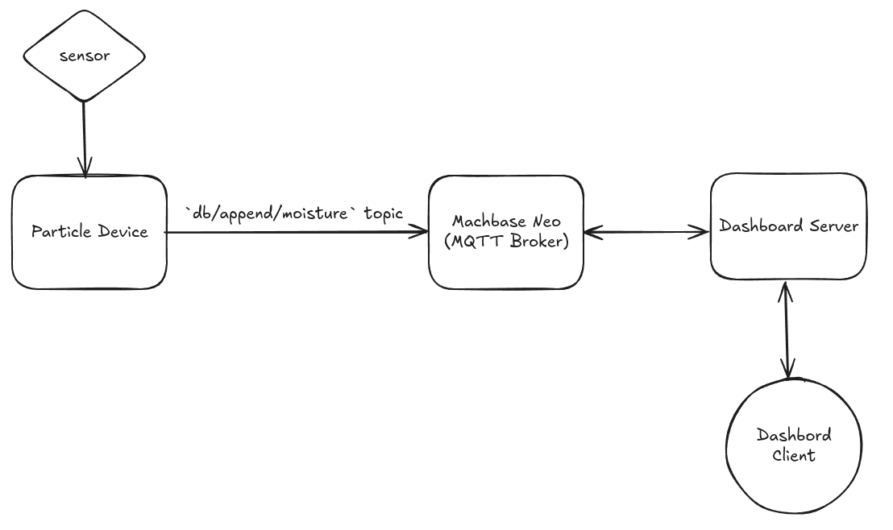

# Radiance Garden Monitoring

<div style={{'display': 'flex'}}>


> "A divine weapon that causes damage and a bright burning effect that lays waste to nearby enemies."
>
> \- Radiance tool tip, Dota 2
</div>

This is a monorepo for a self hosted garden monitoring stack. The monitoring currently
is done with a Particle device collecting data from a capacitive soil moisture sensor
and sent to an MQTT broker. This is an ongoing work with plans for additional sensors
and functionality such as monitoring total sunlight, controlling irrigation systems,
etc.

## System Overview



## Running the Stack

### Requirements

- Docker and `docker-compose`
- Particle Board and sensor (More specifics forthcoming)

### Applications

This stack uses docker-compse to handle running the necessary applications. You can
start it in the same way as any other  

```bash
docker-compose up -d
```

## Particle Firmware

The firmware for the particle board is responsible for collecting the data
from the sensor and sending it to the MQTT broker (see below). Currently you
will need to edit the host manually yourself before flashing your device.

The firmware uses QOS1 for messages and also handles managing disconnections automatically.
Logs can be read via the serial port for debugging purposes.

I am using an Argon board but I am sure a more recent version will do as well. This
is currently done on OS 6.1.1.

### Firmware TODO

- Batch up failed payloads so they can be retried later.
- Figure out how to set MQTT host/port without editing source.
- Figure out why particles built in device ID function returns invalid chars.

## MQTT Broker and Database

Processing and storing messages is powered by [Machbase Neo](https://docs.machbase.com/neo/).

### Initializing Database

To start you will have to create the table that stores our sensor data. Database
queries can be made by connecting to the MQTT broker and sending queries shaped like
the below to the `db/query` topic.

```plaintext
{
    "q": "create tag table if not exists moisture (id varchar(50) primary key, 
           time datetime basetime, value double summarized, device_id varchar(20));",
    "format": "csv",
    "reply": "db/reply/my_query"
}
# to verify that the table is there
{
    "q": "SELECT * FROM moisture;",
    "format": "csv",
    "reply": "db/reply/my_query"
}
```

### Writing Data

For now writing data is only done by the particle firmware. However for
informational purposes, you write data by publishing messages to `db/append/table_name`.
If using the schema above, will be `db/append/moisture`. with the content of:

```plaintext
[["id_value", 1, 2678, "device_id_1"], ["id_value2", 2, 1296, "device_id_1"]]
<!-- or -->
["id_value2", 2, 2015, "device_id_1"]
```

### MQTT TODO

- Automate schema init

## Data Visualization

TBD what this is. May try to experiment with Go+Templ/HTMX. Most likely going
to do something strictly for the learning experience. But regardless of the
exact choice, this will also be hosted on the same machine as the mqtt broker
with docker-compose.
